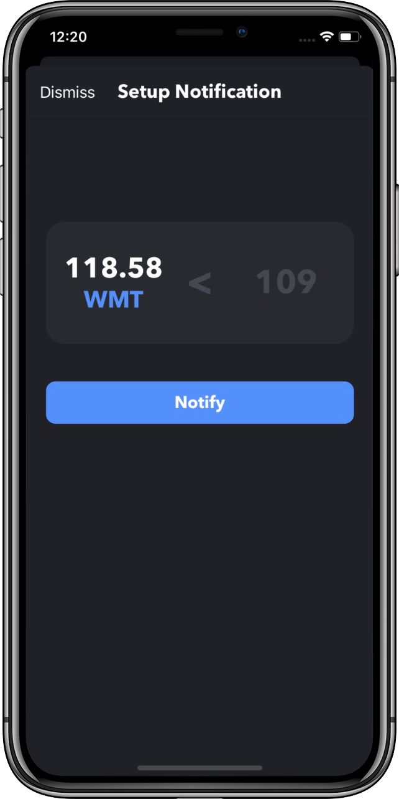

# Stock Notify
Sends a push notification when a stock reaches a price that the user specified. This requires a back-end server which takes the POST request from the mobile device, then sends a push notification when the price is met. This uses the alphavantage.co REST API to fetch the name and price of the stock. The user can favorite stocks which uses Core Data to persist the data. The user interface is built all programmatically. [(Code)](https://github.com/PJ-1997/StockNotify)

&nbsp;&nbsp;&nbsp;&nbsp;&nbsp;&nbsp;&nbsp;&nbsp;&nbsp;&nbsp;&nbsp;&nbsp;&nbsp;&nbsp;&nbsp;&nbsp;

# Quick Formula
[Quick Formula](https://apps.apple.com/us/app/quick-formula/id1462553451?ls=1) calculates math and science formulas. Uses a segmented control to separate math and science formulas.  Available in the App Store.  Quick Formula is built entirely in Swift and the UI is created programmatically with no interface builder. [(Code)](https://github.com/PJ-1997/Formula)

&nbsp;&nbsp;&nbsp;&nbsp;&nbsp;&nbsp;&nbsp;&nbsp;&nbsp;&nbsp;&nbsp;&nbsp;&nbsp;&nbsp;&nbsp;&nbsp

